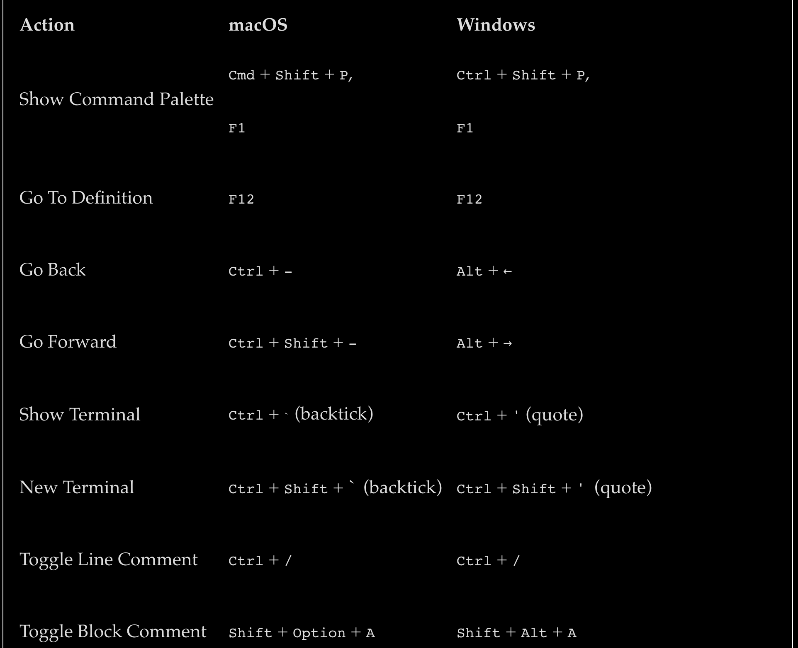

# C# BASICS

# SETUP  
  
- Install VSCode or VS 
- Download .NET	Core SDK [SDK](https://www.microsoft.com/net/download)
- Install c# package --> view --> extensions
- Install C# XML Documentation, C# Extensions, REST Client, ILSpy .NET Decompiler and SharpPad
- 
# NOTES 
**UWP APPS** Universal Windows Platfrom 
  
XCODE required to run on MAC.
  
VS is Windows and slower
VS Code is Open Source but bigger 

## KEYS  

### PDF LINKS 

- [Windows:](https://code.visualstudio.com/shortcuts/keyboard-shortcuts-windows.pdf)
- [macOS:](https://code.visualstudio.com/shortcuts/keyboard-shortcuts-macos.pdf)
- [Linux:](https://code.visualstudio.com/shortcuts/keyboard-shortcuts-linux.pdf)

  

# .NET FUNDAMENTALS
  
For Developers to build applications.
  
Three main .NET framworks 
  
- .NET Core
- .NET Framework
- .NET Standard 
  

