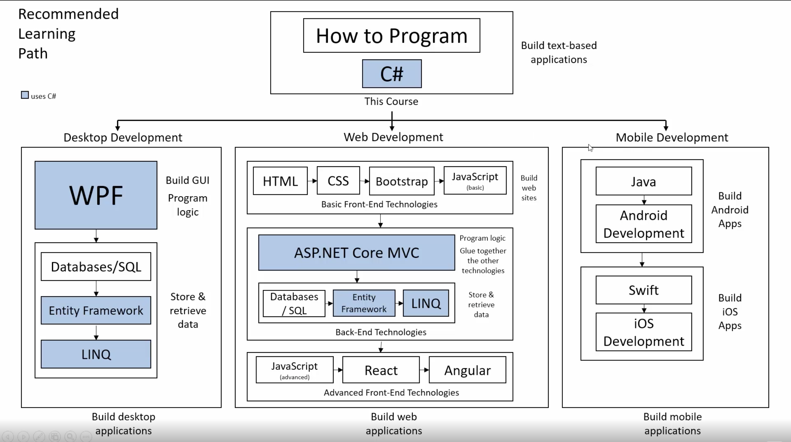

# C# & .NET BASICS


1. [SETUP](#SETUP)
2. [VS CODE](#VS-CODE)
3. [KEYS CONVENTION AND SYNTAX](#KEYS-CONVENTION-AND-SYNTAX)
4. [TERMINAL COMMANDS](#TERMINAL-COMMANDS)
5. [.NET FUNDAMENTALS](#.NET-FUNDAMENTALS)

# SETUP  


  
- Install VSCode or VS 
- Download .NET	Core SDK [SDK](https://www.microsoft.com/net/download)
- Install c# package --> view --> extensions
- Install C# XML Documentation, C# Extensions, REST Client, ILSpy .NET Decompiler and SharpPad
  
## LINKS & NOTES 

[Practice online at ](https://dotnetfiddle.net/ )   
[FAQ](https://github.com/dotnet/standard/blob/master/docs/faq.md)   
[NET Core Command-Line Interface (CLI) tool](https://aka.ms/dotnet-cli-docs)  

**UWP APPS** Universal Windows Platfrom   
XCODE required to run on MAC.

## VS CODE 
  
VS is Windows and slower
VS Code is Open Source but bigger   

**Tips**   

In VS Code type ctl & backtick to open command pallet.  
Go to Definition: F12   
`
Good Practice: When you try to use Go To Definition you will sometimes see an error saying, No definition found. This is because the C# extension does not know about the current project. Navigate to View | Command Palette, enter and select OmniSharp: Select Project, and then select the correct project that you want to work with.`  

## KEYS CONVENTION AND SYNTAX

  
  
| Naming convention	   |      Examples      |  Use for |
|----------|:-------------:|------:|
| Camel case |  cost, orderDetail, dateOfBirth | Local variables, private fields. |
| Title case |    String, Int32, Cost, DateOfBirth, Run  |   Types, non-private fields, and other members like methods.|


## Escape Characters

### Space  

`string fullNameWithTabSeparator = "Bob\tSmith";`  becomes `Bob Smith`

## Verbatim String (Ignore Escape char)
  
use the `@` symbol before the string.  

`string filePath = @"C:\televisions\sony\bravia.txt";`

### Interpolated string 
  
A literal string prefixed with $ to enable embedded formatted variables. You will learn more about this later in this chapter.

### NUMBERS 

```
// unsigned integer means positive whole number

// including 0

uint naturalNumber = 23;

// integer means negative or positive whole number

// including 0

int integerNumber = -23;

// float means single-precision floating point

// F suffix makes it a float literal

float realNumber = 2.3F;

// double means double-precision floating point

double anotherRealNumber = 2.3; // double literal
```

### BINARY & HEX

Start a number with `0b` for binary and `0x` for hex.


```
// three variables that store the number 2 million

int decimalNotation = 2_000_000;

int binaryNotation = 0b_0001_1110_1000_0100_1000_0000;

int hexadecimalNotation = 0x_001E_8480;
```
  
Boolean compare 
  
```
Console.WriteLine($"{decimalNotation == binaryNotation}");
```

## USEFUL METHODS

**SIZE OFF** 
  
Run in console   
`Console.WriteLine($"int uses {sizeof(int)} bytes and can store numbers in the range {int.MinValue:N0} to {int.MaxValue:N0}.");`  
  
`Console.WriteLine($"double uses {sizeof(double)} bytes and can store numbers in the range {double.MinValue:N0} to {double.MaxValue:N0}.");`  
  
  
*NOTE A DOUBLE CAN STORE BIGGER NUMBERS THAN A DECIMAL BUT MAY NOT BE ACCURATE BECAUSE SOME NUMBERS CAN NOT BE REPRESENTED AS A FLOATING POINT VALUE*  


### PDF LINKS 

- [Windows:](https://code.visualstudio.com/shortcuts/keyboard-shortcuts-windows.pdf)
- [macOS:](https://code.visualstudio.com/shortcuts/keyboard-shortcuts-macos.pdf)
- [Linux:](https://code.visualstudio.com/shortcuts/keyboard-shortcuts-linux.pdf)


## TERMINAL COMMANDS
  
In terminal run the following:  

### Generate Console Application components  

`dotnet new console`  
  
### Compile & Run  

`dotnet run`
  
### Documentation  

`dotnet help new`
  
or get help for command line argument 
  
`dotnet new console -h`


# .NET FUNDAMENTALS
  
For Developers to build applications. Originally optimised for windows.  
.NET **is core to windows operating system** and installed on over one billion computers, this is why it must change as little as possible. So bugfixes and updates are infrequent. 

## Good Practice

Practically speaking, .NET Framework is Windows-only and a legacy platform. **Do not create new apps using it**  


### Three main .NET framworks 
  
- .NET Core
- .NET Framework
- .NET Standard 
  
Includes : 

1. Common Language Runtime (CLR), manages code execution
2. Base Class Library (BCL)

- Mono and Xamarin projects are community/open source Xamarin bought over. 
```
.NET Core: for cross-platform and new apps.
.NET Framework: for legacy apps.
Xamarin: for mobile apps.
```  

## .NET core 

.NET Core includes a cross-platform implementation of the CLR known as CoreCLR and a streamlined library of classes known as CoreFX.  
Fast moving, lots of changes; 'does not affect application stability' as it can be deployed side by side with an App.  
Is getting smaller as non essential (windows only stuff) gets removed .
 
## Future of .NET  
  
.NET Core 3.0 will be renamed to .NET and skip version 4 not to be confused with NET Framework 4.x. So, the next version of .NET Core will be .NET 5.0 and it is scheduled for release in November 2020.   
After that releases will be annually.    
UWP will be on custom .NET core as its not cross platform.   
 
**ASP.NET Web Forms** and **Windows Communication Foundation (WCF)** are old web application and service technologies that fewer developers are choosing to use for new development projects today, so they have also been removed from .NET Core. Instead, developers prefer to use ASP.NET MVC and ASP.NET Web API. These two technologies have been refactored and combined into a new product that runs on .NET Core, named **ASP.NET Core**.  
  
```
By the end of 2020, Microsoft promises that there will be a single .NET platform instead of three. 
```

## .NET STANDARD 

. NET Standard solves the code sharing problem for . NET developers across all platforms by bringing all the APIs that you expect and love across the environments that you need: desktop applications, mobile apps & games, and cloud services.  

. NET Standard is a formal specification of . NET APIs that are intended to be available on all . NET implementations.  

To use the .NET Standard, you must install a .NET platform that implements the .NET Standard specification. .NET Standard 2.0 is implemented by the latest versions of .NET Framework, .NET Core, and Xamarin.
  
The latest .NET Standard, 2.1, is only implemented by .NET Core 3.0, Mono, and Xamarin. Some features of C# 8.0 require .NET Standard 2.1. .NET Standard 2.1 is not implemented by .NET Framework 4.8 so we should treat .NET Framework as legacy.

## C# Intermediate Langauge (IL)
  
- C# Compilire is called **Roslyn** 
- Used by the .net CLI tool converts it into **IL** code and stores the IL in an assembly (a **DLL** or **EXE file**). 
- .NET Core's virtual machine, known as  **CoreCLR** exeutes IL code DLL/EXE
  
## JUST IN TIME COMPILATION 

At runtime,  **CoreCLR loads the IL code** from the assembly, the just-in-time (JIT) compiler compiles it into native CPU instructions, and then it is executed by the CPU on your machine. The benefit of this three-step compilation process is that Microsoft is able to create CLRs for Linux and macOS, as well as for Windows. The same IL code runs everywhere because of the second compilation process, which generates code for the native operating system and CPU instruction set.

## Understanding .NET Native 

Another .NET initiative is called .NET Native. This compiles C# code to native CPU instructions ahead of time (AoT), rather than using the CLR to compile IL code JIT to native code later. .NET Native improves execution speed and reduces the memory footprint for applications because the native code is generated at build time and then deployed instead of the IL code. 
  
### JIT VS NATIVE 

JIT:   
1. Compile to Exe/Dll
2. CoreCLR Loads
3. JIT Compiles to Native 
4. Executes 

NATIVE :  
1. Compiles direct to native 
2. Executes at run on mac/linux whatever